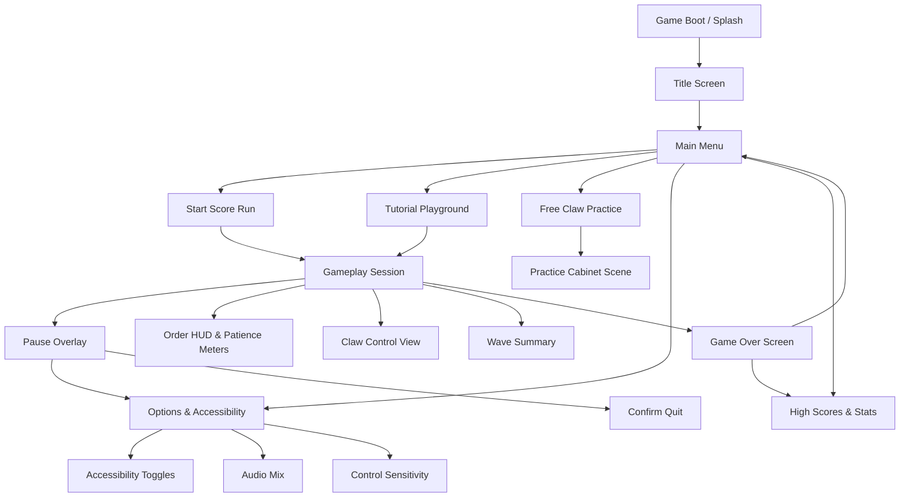
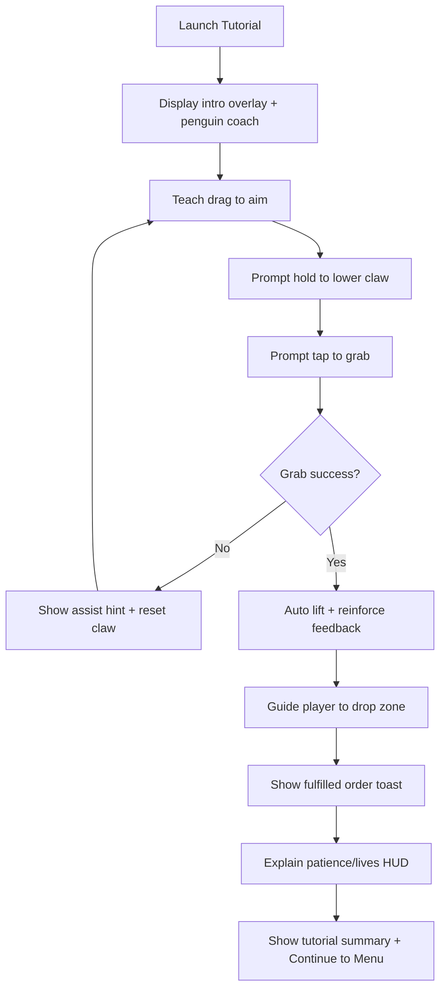
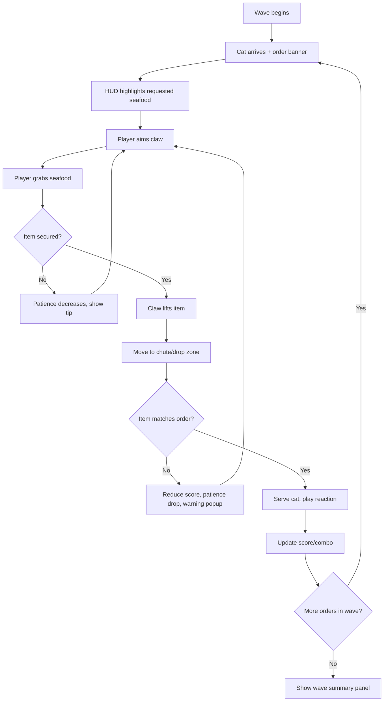
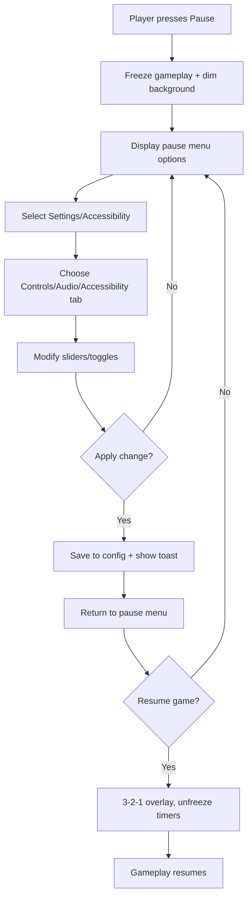

# Claw and Snackle UI/UX Specification

## Introduction
Claw and Snackle’s UI/UX specification anchors the mobile-first experience for our penguin-run claw restaurant. It aligns designers and developers on how the game should look, feel, and respond across portrait and landscape. The spec emphasizes tactile claw interactions, fast read time for orders and patience meters, and thoughtful accessibility so frantic sessions stay inviting while sustaining 60 FPS on iOS and Android targets.

### Overall UX Goals & Principles
#### Target User Personas
- **Precision Claw Enthusiast** – Hunts for physics authenticity; replays runs to shave claw drift, expects granular feedback on grip strength and swing.
- **Relaxed Commuter** – Plays in short bursts, one hand on portrait phone; needs quick resume, readable orders in sunlight, forgiving aim assists.
- **Showtime Streamer** – Records or streams mobile gameplay; favors clean HUD overlays, customizable contrast, and exciting cat reactions for viewers.

#### Usability Goals
- Tutorial completion rate ≥ 90% within the first 3 minutes of onboarding.
- Average claw mis-grab rate < 10% by wave 3 (post-onboarding) thanks to snap/assist cues.
- Critical HUD (orders, patience, lives) readable at arm’s length on 6" phones with WCAG-compliant contrast.
- Accessibility toggles (colorblind, haptics off, camera sensitivity) discoverable within 2 taps from pause.

#### Design Principles
1. **Feel the Claw** – Reinforce weighty physics and responsive feedback with signals on every input; never fake success.
2. **Service Clarity First** – Orders, timers, and patience states stay visually dominant; décor and VFX never obscure service surfaces.
3. **One-Hand Friendly Layouts** – Anchor primary actions within thumb arcs (≤ 60 px from bottom corners in portrait) and support quick swipe gestures.
4. **Ramp with Reassurance** – As waves intensify, surface contextual coaching (glows, audio cues) to keep pressure fun rather than punishing.
5. **UI Never Blocks 60 FPS** – Choose lightweight Godot Control patterns, cull hidden nodes, and cap animated HUD updates so the claw loop stays buttery.
6. **Delight in Cozy Moments** – Reward success with expressive cat reactions and penguin flourishes that strengthen the restaurant fantasy without adding noise.

### Change Log
| Date       | Version | Description                   | Author                     |
|------------|---------|-------------------------------|----------------------------|
| 2025-09-30 | v0.1    | Initial UI/UX specification. | Sally (Godot Game UX Expert) |

## Information Architecture (IA)
### Site Map / Screen Inventory


### Navigation Structure
**Primary Navigation:** Main Menu tiles (Start Score Run, Tutorial, Practice, Options, High Scores) sized for thumb reach. In-session HUD anchors core controls (claw joystick, grab button, drop zone) at bottom corners in portrait, transitioning to side panels in landscape.

**Secondary Navigation:** Pause overlay vertical stack (Resume, Restart, Options, Quit). Options screen tabs for Controls / Audio / Accessibility. Swipe carousel for cabinet skins (future extension).

**Breadcrumb Strategy:** Lightweight text badges (e.g., “Tutorial › Wave 1”, “Score Run › Wave 3”) shown in HUD top bar. Options subpages display parent label (e.g., “Options / Accessibility”) for quick context.

## User Flows
### Onboard in Tutorial Playground
**Player Goal:** Learn claw controls, order flow, and HUD meaning before entering score run.

**Entry Scene:** res://scenes/tutorial_playground.tscn

**Input Methods:** Touch (drag/aim), tap (grab/drop), swipe (camera), optional Bluetooth gamepad mapping.

**Performance Target:** 60+ FPS throughout

**Success Criteria:** Player completes all tutorial steps, successfully grabs and delivers practice seafood, and reaches summary banner with zero lives lost.

#### Flow Diagram


#### Edge Cases & Error Handling
- Player releases claw early → slow-mo overlay explaining long-press mechanic.
- Device orientation change mid-step → reflow HUD and repeat current instruction.
- Accessibility toggle triggered mid-tutorial → confirm and reapply overlay colors without resetting tutorial.
- Tutorial skipped from pause → mark onboarding incomplete flag for future reminders.

**Notes:** Use `AnimationPlayer` for step callouts; assist hints appear via `CanvasLayer` to avoid blocking 3D scene. Ensure `Tween` easing keeps instructions snappy but not jarring.

### Fulfill Customer Order During Score Run
**Player Goal:** Grab requested seafood and serve cat before patience meter expires.

**Entry Scene:** res://scenes/session_main.tscn

**Input Methods:** Touch joystick pad for claw movement, drag camera, tap grab/release buttons, optional gamepad analog + buttons.

**Performance Target:** 60+ FPS throughout

**Success Criteria:** Correct seafood delivered, combo multiplier updated, patience meter remains non-zero, life count unchanged.

#### Flow Diagram


#### Edge Cases & Error Handling
- Wrong item dropped → show red outline, decrement combo, highlight correct item again.
- Patience expires → trigger fail animation, subtract life, auto-clear current claw state.
- Physics jitter causes dropped item to bounce out → re-open claw, pause patience drain briefly, prompt “Steady the claw.”
- Player pauses mid-order → freeze timers, dim HUD, resume with 2-second grace period.

**Notes:** Clamp camera drift to avoid motion sickness; use `AudioStreamPlayer` cues to telegraph low patience. Keep HUD updates in `_process` lightweight (use `call_deferred` to update textures).

### Adjust Accessibility Settings Mid-Run
**Player Goal:** Pause session, tweak options (colorblind filters, haptics, sensitivity), and safely resume.

**Entry Scene:** res://scenes/ui/pause_overlay.tscn

**Input Methods:** Tap pause button, drag sliders, toggle switches; gamepad Start button, D-pad for toggle focus.

**Performance Target:** 60+ FPS throughout

**Success Criteria:** Desired setting applied, confirmation toast shown, player resumes within 10 seconds without losing an order.

#### Flow Diagram


#### Edge Cases & Error Handling
- Player lowers sensitivity too far → snap to minimum usable threshold and show tip.
- Colorblind mode toggled → live-preview filters without reloading scene.
- Touch accessibility slider dragged off-screen in landscape → auto-scroll container to keep handle visible.
- Player closes app while paused → persist new settings and restore to pause state on relaunch.

**Notes:** Run setting saves asynchronously to avoid frame hitches; use Godot `ConfigFile` autoload. Ensure haptic toggle updates both runtime signals and stored preference immediately.

## Wireframes & Mockups
**Primary Design Files:** Not applicable — this specification is the canonical source for scene layout and hierarchy.

### Key UI Scene Layouts
#### `title_screen.tscn`
```
Purpose: Welcome players, showcase penguin & claw vignette, route to primary modes.
Control Node Hierarchy:
Control (root)
├── TextureRect (background art)
├── MarginContainer
│   └── VBoxContainer
│       ├── Label (logo)
│       ├── Button (Start Score Run)
│       ├── Button (Tutorial)
│       ├── Button (Practice Cabinet)
│       └── HBoxContainer (Options, High Scores)
├── AnimatedSprite2D (cat cameo)
└── CanvasLayer (news banner)
Anchoring Strategy: Center with 10% horizontal margins; responsive stretch for landscape using size flags.
InputMap Actions: ui_accept, ui_select_mode, ui_cancel.
Performance Impact: Minimal; static background + limited sprite animation.
Theme Resource: res://themes/title_theme.tres
```

#### `session_hud.tscn`
```
Purpose: Present orders, patience meters, claw controls, score, and lives during runs.
Control Node Hierarchy:
Control (root)
├── CanvasLayer (HUD overlay)
│   ├── VBoxContainer (top bar)
│   │   ├── HBoxContainer (Order banners + timers)
│   │   └── ProgressBar (Wave progress)
│   ├── HBoxContainer (mid info band)
│   │   ├── VBoxContainer (Lives, score, combo)
│   │   └── VBoxContainer (Cat reaction portrait)
│   └── MarginContainer (action bar)
│       └── HBoxContainer
│           ├── TextureButton (Grab)
│           ├── JoystickPad (virtual joystick)
│           └── Button (Drop/Release)
└── Control (orientation adapters)
Anchoring Strategy: Bottom action bar anchored within thumb reach in portrait and side-aligned in landscape; top HUD pinned with safe-area padding.
InputMap Actions: claw_move (vector), claw_grab, claw_release, ui_pause.
Performance Impact: Moderate; batch HUD updates via call_deferred, reuse textures.
Theme Resource: res://themes/session_theme.tres
```

#### `pause_overlay.tscn`
```
Purpose: Freeze action, expose accessibility/settings, allow resume or exit.
Control Node Hierarchy:
Control (root)
├── ColorRect (dim backdrop, 0.6 alpha)
├── MarginContainer
│   └── VBoxContainer
│       ├── Label (Paused)
│       ├── Button (Resume)
│       ├── Button (Restart Wave)
│       ├── Button (Settings Tabs)
│       ├── Button (Quit to Menu)
└── HBoxContainer (Quick toggles row for haptics/colorblind/sensitivity)
Anchoring Strategy: Centered card with responsive width; obey safe-area padding.
InputMap Actions: ui_accept, ui_cancel, ui_focus_next, ui_focus_prev.
Performance Impact: Light; overlay runs while gameplay is paused, so keep shaderless and reuse theme styles.
Theme Resource: res://themes/overlay_theme.tres
```

## Godot UI Component Library
**Godot UI Approach:** Scene-based composition using Control nodes with an autoloaded `UIManager` orchestrating signals; each UI piece instanced as `.tscn` and preloaded for low-latency swaps.

**Theme Strategy:** Single base theme with scene-specific overrides managed through `ThemeDB`. Avoid per-node overrides to keep batching consistent.
- Base Theme: res://themes/base_theme.tres
- Theme Overrides: Scene-level theme resources (e.g., session HUD, overlays) swapped via `UIManager`.

**Language Choice:** GDScript for UI logic
- Rationale: Fast iteration, tight integration with Control signals, and static typing cover performance needs. Heavy systems remain in gameplay layer, so UI does not warrant C# overhead.

### Core Components
#### OrderBanner
- **Scene Path:** res://ui/components/OrderBanner.tscn
- **Purpose:** Display cat’s requested seafood, highlight urgency, show combo multiplier.
- **Control Type:** HBoxContainer
- **Signals:**
  - `order_acknowledged(order_id: int)`
  - `urgency_changed(new_state: String)`
- **Export Variables:**
  - `@export var order_id: int`
  - `@export var seafood_icon: Texture2D`
  - `@export var patience_thresholds: Array[int]`
- **States:** `pending`, `warning`, `critical` (style swaps via theme variants).
- **Performance:** Use cached textures; update only on patience threshold crossing to minimize redraws.
- **Usage Guidelines:** Instantiate per cat; connect to `UIManager` to react to wave pacing; hide when order completes.

#### PatienceMeter
- **Scene Path:** res://ui/components/PatienceMeter.tscn
- **Purpose:** Visualize remaining patience with color cues and pulse animation.
- **Control Type:** TextureProgressBar
- **Signals:**
  - `meter_empty(order_id: int)`
  - `threshold_crossed(order_id: int, level: String)`
- **Export Variables:**
  - `@export var order_id: int`
  - `@export var decay_curve: Curve`
- **States:** `steady`, `accelerated`, `empty`.
- **Performance:** Shaderless StyleBox; avoid per-frame color changes—toggle pre-defined gradients.
- **Usage Guidelines:** Bind to order lifecycle; update via deferred calls to avoid blocking `_process` loops.

#### VirtualJoystick
- **Scene Path:** res://ui/components/VirtualJoystick.tscn
- **Purpose:** Touch thumbstick for claw movement with dead-zone handling.
- **Control Type:** TouchScreenButton + Sprite overlays
- **Signals:**
  - `movement_vector(vector: Vector2)`
  - `released()`
- **Export Variables:**
  - `@export var deadzone: float = 0.2`
  - `@export var max_radius: float = 120.0`
- **States:** `idle`, `dragging`, `locked`.
- **Performance:** Cache vector math; use `_unhandled_input` to avoid GUI event spam.
- **Usage Guidelines:** Anchor bottom-left portrait, bottom-center landscape; integrate with InputMap `claw_move`.

#### QuickToggle
- **Scene Path:** res://ui/components/QuickToggle.tscn
- **Purpose:** Toggle accessibility options (haptics, colorblind mode) instantly from pause overlay.
- **Control Type:** Button subclass
- **Signals:**
  - `toggled(option_name: String, enabled: bool)`
- **Export Variables:**
  - `@export var option_name: String`
  - `@export var icon_on: Texture2D`
  - `@export var icon_off: Texture2D`
- **States:** `on`, `off`.
- **Performance:** Swap textures using `TextureButton` to avoid redraw; keep icons in atlas.
- **Usage Guidelines:** Feed into Settings singleton; update theme to reflect active state.

## Game Visual Style Guide
### Visual Identity
- **Game Art Style:** Cozy low-poly 3D seafood arcade with warm glacial lighting. UI overlays use soft translucent panels and pastel gradients inspired by icebergs at sunset (teal, coral, cream). Elements echo claw-machine marquees with rounded corners and subtle glow.
- **Godot Theme Resources:**
  - Main Theme: res://themes/main_theme.tres
  - Dark Theme: res://themes/dark_theme.tres (pause overlay/night waves)
- **StyleBox Resources:**
  - Panel: res://themes/styles/panel_style.tres (DropShadowBox, 6 px radius)
  - Button: res://themes/styles/button_style.tres (StyleBoxFlat gradient, 10 px radius)

### Color Palette
| Color Type | Hex Code | Usage |
|------------|----------|-------|
| Primary    | #2BB2C9  | Action buttons, primary highlights |
| Secondary  | #F6A57A  | Secondary actions, cat reaction UI |
| Accent     | #FFE066  | Combo glow, celebratory accents |
| Success    | #7ED957  | Order success states |
| Warning    | #FFB347  | Patience low alerts |
| Error      | #FF5E5B  | Wrong item, life lost indicators |
| Neutral    | #F2F7FA / #1F2A38 / #AEB9C6 | Background panels / primary text / secondary text |

### Typography
- **Font Resources:**
  - Primary: res://fonts/NunitoSans-Bold.ttf
  - Secondary: res://fonts/NunitoSans-Regular.ttf
  - Monospace: res://fonts/RobotoMono-Medium.ttf

  **Dynamic Font Settings:**
  - Use Mipmaps: true
  - Antialiasing: true
  - Hinting: Light

- **Type Scale**
| Element | Size | Weight | Line Height |
|---------|------|--------|-------------|
| H1      | 36px | Bold       | 42px |
| H2      | 28px | Semi-Bold  | 34px |
| H3      | 22px | Semi-Bold  | 28px |
| Body    | 18px | Regular    | 24px |
| Small   | 14px | Regular    | 18px |

### Iconography
- **Icon Atlas:** res://ui/icons/icon_atlas.png
- **Icon Size Standards:** Small 20×20, Medium 32×32, Large 64×64
- **Texture Import Settings:** Filter Linear, Mipmaps generated, sRGB true
- **Usage Guidelines:** Maintain rounded silhouettes to match button radius; stroke thickness 2 px; success/warning/error icons use palette above; consistent drop shadow for readability on icy backgrounds.

### Spacing & Layout
- **Container System:**
  - MarginContainer: 24 px outer margin mobile (32 px tablet)
  - H/VBox separation: 12 px
  - GridContainer columns: 2 portrait, 3 landscape
- **Anchor Presets:** Full-rect with custom margins for HUD panels; center anchor for modal overlays; top anchors for status bars.
- **Spacing Scale:** 8 px base spacing ramp (8, 16, 24, 32).
- **Safe Area Margins:** 30 px top, 20 px sides, 40 px bottom for mobile notches/home gestures.

## Game Accessibility Requirements
### Compliance Target
- **Standard:** WCAG 2.1 AA-inspired mobile targets adapted for Godot UI.
- **Godot Accessibility Features:**
  - InputMap remapping for all UI and gameplay actions.
  - Theme variants for high-contrast and colorblind palettes (Protanopia/Deuteranopia/Tritanopia).
  - DynamicFont scaling between 0.85× and 1.5× base size with mipmaps for clarity.
  - Accessibility toggles must maintain 60+ FPS and run without extra draw calls.

### Key Requirements
**Visual (Godot Theme System):**
- Color contrast ratio ≥ 4.5:1 for body text, ≥ 3:1 for large text/icons.
- Focus indicators via StyleBoxFlat outlines (4 px, high-contrast accent).
- DynamicFont scaling range 14 px–28 px with saved preference per profile.
- Colorblind modes implemented as theme variations with palette adjustments.

**Interaction (InputMap):**
- Full keyboard navigation using `ui_up/down/left/right`, `ui_accept`, `ui_cancel`.
- Gamepad navigation mirrored with prompts for common controllers.
- Touch targets minimum 44×44 px with 8 px spacing buffer.
- Hold-to-confirm (500 ms) for destructive actions like quitting mid-run.
- Input buffer of 2 frames to tolerate rapid taps during high-pressure play.

**Performance:**
- Accessibility toggles add zero new draw calls.
- Theme switching executes in ≤ 50 ms with preloaded resources.
- Dynamic font scaling updates happen via `call_deferred` to avoid frame spikes.

### Testing Strategy
- Automated InputMap validation ensuring all UI scenes respond to keyboard, gamepad, and touch.
- Run contrast checker script comparing theme colors; log below-threshold results.
- Profile with accessibility modes toggled to confirm frame time < 16.67 ms.
- Use GUT tests to verify touch target rectangles stay ≥ 44 px in layout.
- Manual smoke test on mid-range iOS/Android devices; capture video for review.

## Godot UI Responsiveness Strategy
### Viewport Configuration
- **Project Settings:**
  - Base Resolution: 1080×1920 (portrait baseline)
  - Stretch Mode: canvas_items
  - Stretch Aspect: keep_width

### Resolution Support
| Resolution | Aspect | Platform | UI Scale |
|------------|--------|----------|----------|
| 1280×720   | 16:9   | Mobile (landscape sessions) | 1.0× |
| 1920×1080  | 16:9   | Tablet / Desktop preview    | 1.5× |
| 1440×3200  | 9:20   | High-end Android portrait   | 0.9× |
| 2340×1080  | 19.5:9 | iPhone portrait             | 0.95× |

### Godot UI Adaptation Patterns
- **Anchor Presets:** Mobile uses full-rect HUD panels with safe margins; tablet/desktop centers containers to 70% width; wide landscape anchors action bar left/right with top status bar.
- **Container Adjustments:** Portrait favors VBox stacks for thumb reach. Landscape uses HBox or GridContainer to split controls vs. status. Tablet options menus expand to two-column grids.
- **Control Visibility:** Hide practice info overlays on sub-6" devices. Pause overlay shows condensed toggles when width < 900 px. Use `Control.visible` toggles via `UIManager` orientation signal.
- **Font Scaling:** Dynamic font multiplier = min(device_height / 1920, 1.5). Minimum body size 16 px for readability.
- **Performance:** Responsive adjustments precomputed on `_ready`; orientation swaps trigger batched updates to maintain 60 FPS.

## Godot UI Animation & Transitions
### Motion Principles
- Use `AnimationPlayer` for orchestrated sequences (order banner slide-in, tutorial prompts).
- Use `Tween` for simple property animations (button press scale, patience pulse).
- Keep animations ≤ 0.25 s for responsiveness; queue-free transitions for cat reactions.
- Maintain 60+ FPS; avoid per-frame script updates—drive via animation tracks.
- Provide `UIManager.animation_speed` multiplier and accessibility toggle to disable motion.
- Anchor animations to gameplay feedback: claw success triggers immediate particle pulse + sound.
- Respect input priority: animations never block next interaction; run in parallel.
- Cancel/resume animations gracefully on orientation change via `AnimationPlayer.stop(true)`.

### Key UI Animations
- **Order Banner Slide-In** – AnimationPlayer; animates position.y and modulate.a; 0.2 s; Trans.CUBIC easing; low impact; can disable.
- **Patience Meter Pulse** – Tween; animates scale and modulate; 0.3 s loop; Trans.QUAD easing; low impact; can disable.
- **Pause Overlay Fade** – AnimationPlayer; animates modulate.a (and optional blur intensity); 0.18 s; Trans.CUBIC easing; medium impact (disable blur on mobile); can disable.
- **Cat Reaction Pop** – Tween; animates scale and rotation; 0.22 s; Trans.QUAD easing; low impact; can disable.

## UI Performance Requirements
- **Frame Rate:** Maintain ≥ 60 FPS (≤ 16.67 ms frame time) even during heavy wave HUD updates.
- **Scene Load:** Menu ↔ gameplay transitions complete within 2 seconds on mid-range mobile hardware.
- **Input Response:** Touch and gamepad inputs produce UI feedback in ≤ 30 ms.
- **Draw Calls:** UI contributes ≤ 15 additional draw calls; batch via shared themes and atlases.
- **Control Nodes:** Limit to ≤ 80 active Control nodes per scene; defer instancing of optional overlays.
- **Theme Complexity:** Keep active StyleBox resources ≤ 8 per scene; load additional variants on demand.

### Optimization Strategies
**Node Optimization:** Instance UI components from pools; toggle visibility instead of freeing nodes; lazily instantiate tutorial callouts and recycle on completion.

**Rendering Optimization:** Use nine-patch textures for scalable panels; group HUD elements by layer to minimize overdraw; bake icon atlas at power-of-two sizes for cache friendliness.

**Update Optimization:** Drive HUD updates via gameplay signals (no polling); batch scoreboard updates inside `UIManager.update_scores()`; defer layout recalculations when multiple values change.

**Language Choice:** Typed GDScript for UI state handling. Reserve C# for future heavy modules (e.g., replay recording) only if profiling reveals bottlenecks.

## Godot UI Design Patterns
### Common UI Patterns
- **Dialog System:** Use `PopupPanel` for modal dialogs; `AcceptDialog` / `ConfirmationDialog` for prompts; connect `dialog.popup_hide` to cleanup callbacks.
- **Menu Navigation:** `TabContainer` for multi-page interfaces; `Tree` for hierarchical lists if needed; manage focus with `grab_focus()` on default buttons.
- **HUD Layout:** Wrap HUD in `CanvasLayer`; place panels in `MarginContainer` to respect safe areas; anchor bottom controls for thumb reach.
- **Inventory Grid:** For practice/free claw inventory, use `GridContainer` (fixed columns) with `ItemList` for scrollable lists; handle drag-and-drop via `Control._gui_input()`.
- **Meters & Bars:** Use `TextureProgressBar` with custom StyleBox; animate deltas via `Tween` to smooth changes.

### UI Signal Patterns
```gdscript
button.pressed.connect(_on_button_pressed)
button.button_down.connect(_on_button_down)
button.toggled.connect(_on_button_toggled)
```
```gdscript
func _gui_input(event: InputEvent) -> void:
    if event.is_action_pressed("ui_accept"):
        # Handle input while preserving 60 FPS
```
```gdscript
signal value_changed(new_value: float)
signal item_selected(item_id: int)
```

## Godot UI Implementation Guide
### UI Scene Organization
```
res://
├── ui/
│   ├── scenes/
│   │   ├── title_screen.tscn
│   │   ├── session_hud.tscn
│   │   ├── pause_overlay.tscn
│   │   └── practice_hud.tscn
│   ├── components/
│   │   ├── OrderBanner.tscn
│   │   ├── PatienceMeter.tscn
│   │   ├── VirtualJoystick.tscn
│   │   └── QuickToggle.tscn
│   └── popups/
│       ├── TutorialPrompt.tscn
│       └── WaveSummary.tscn
```
- **Script Organization:**
  - UI Logic: GDScript with static typing (`extends Control` with `@onready` caching).
  - Performance-critical utilities (if required): C#; none planned for MVP.
  - Autoload: `UIManager` singleton mediates signals, orientation changes, and animation speed toggle.

### Theme Resource Setup
- **Theme Hierarchy:** Base theme extends project font/color defaults; scene-specific variations (title, session, overlay) loaded once and reused.
- **Resource Preloading:** Preload component scenes in `UIManager` to reduce hitching; load themes at startup; cache StyleBox resources for state swaps.

### InputMap Configuration
- **UI Actions:**
  - `ui_accept`: Space, Enter, Gamepad A, Touch tap
  - `ui_cancel`: Escape, Gamepad B, two-finger tap (pause)
  - `ui_up/down/left/right`: Arrow keys, WASD, D-pad, joystick
  - `ui_focus_next`: Tab, Gamepad RB
  - `ui_focus_prev`: Shift+Tab, Gamepad LB
  - `claw_move`: Virtual joystick vector
  - `claw_grab`: Touch grab button, Gamepad X
  - `claw_release`: Touch drop button, Gamepad Y

- **Touch Gestures:**
  - Tap: `ui_accept`
  - Long press: Hold-to-confirm destructive actions
  - Swipe: Camera pan / menu navigation
  - Pinch (optional future): Zoom in practice cabinet

## Next Steps
1. Create base theme resource at `res://themes/base_theme.tres` and derive scene variations.
2. Implement `UIManager` autoload to coordinate orientation, animations, and pooled components.
3. Build `title_screen.tscn`, `session_hud.tscn`, and `pause_overlay.tscn` using hierarchies above.
4. Configure InputMap actions and virtual joystick script.
5. Write initial GUT tests covering `OrderBanner` and `PatienceMeter` states.
6. Profile HUD updates on mobile hardware to confirm ≤ 16.67 ms frame time.

### Godot UI Handoff Checklist
- [ ] All UI scenes mapped with `.tscn` files
- [ ] Control node hierarchies match specification
- [ ] Theme resources prepared and loaded
- [ ] InputMap actions configured and tested
- [ ] Anchor presets documented in code comments
- [ ] 60+ FPS performance validated on target devices
- [ ] GUT test coverage in place for core components
- [ ] Language strategy (GDScript vs. C#) confirmed per component
- [ ] Accessibility features implemented and profiled
- [ ] Touch controls configured for portrait and landscape

## Checklist Results
Pending – run Godot UI/UX checklist once implementation milestones are met.
